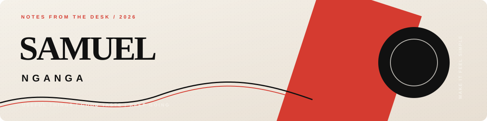
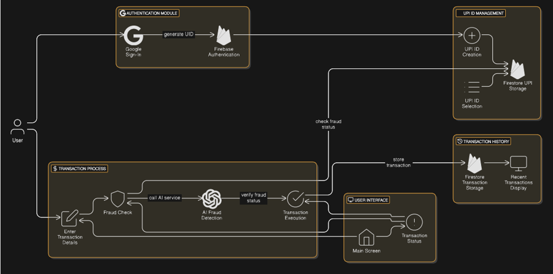
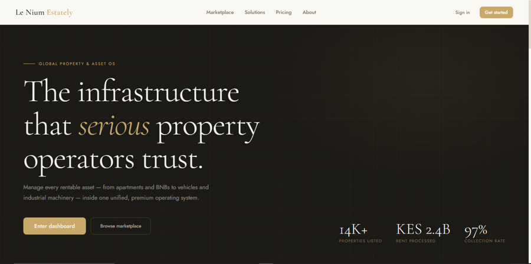
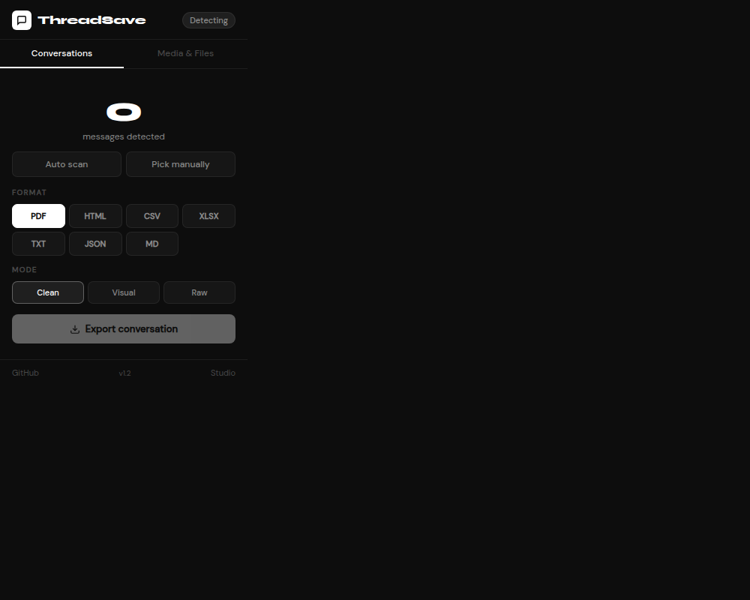

  

**Samuel Nganga**  
*I make software feel less like software.*

[portfolio](https://builtbysamuel.netlify.app/) · [linkedin](https://www.linkedin.com/in/samuel-nganga-594b342a1/) · [email](mailto:samuelnganga7933@gmail.com)

I like good ideas, clear interfaces, messy problems, and making the next version better than the last.

 

&nbsp;
&nbsp;

  <b>SafePayAI</b> · <b>Le Nium Estately</b> · <b>Thread Saver</b>

